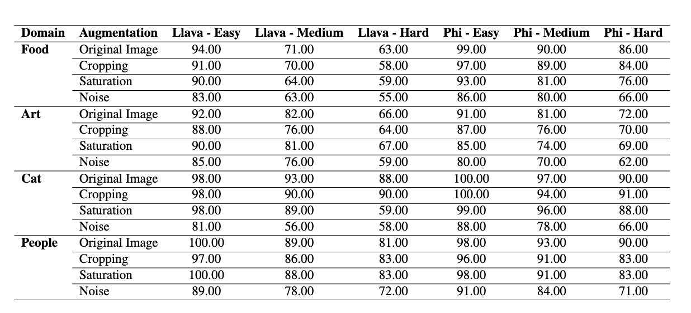

# VQA4Mix

## Introduction

This repository contains the implementation and experiments for **VQA4Mix**, focusing on visual question answering (VQA) in mixed datasets. It includes training scripts, inference scripts, and the necessary steps to reproduce the reported results.

---

## Setup Instructions

### Prerequisites

- Python >= 3.8
- PyTorch >= 1.9.0

### Environment Setup

1. Clone this repository:
   ```bash
   git clone https://github.com/godlikeS97/VQA4Mix.git
   cd VQA4Mix
   ```

2. Create and activate a virtual environment:
   ```bash
   python3 -m venv vqa4mix_env
   source vqa4mix_env/bin/activate
   ```

---

## Data Preparation

### Obtaining the Data

1. Download the datasets:
   - Specify the datasets used (e.g., COCO, Art Cap).

2. Unzip the downloaded datasets and place them in the `data/` directory:
   ```bash
   mkdir data
   mv <downloaded_dataset> data/
   ```

3. Preprocess the data by running the preprocessing jupyter Notebook under each corresponding folder in demo:

---

#### Key Metrics:
- Accuracy in MCQ

---

## Example Results


---


## Contact

For questions or issues, please create an issue in this repository or contact the authors.

---
